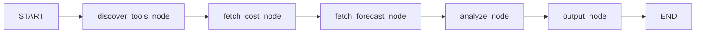

# AWS Cost Analysis + Remediation Agent

This project provides a Flask app backed by two LangGraph workflows:

- **Manager graph** (`graph/manager_graph.py`) for AWS cost analysis + forecast
- **Remediation graph** (`graph/remediation_graph.py`) for actionable cost optimization recommendations

It integrates with the AWS Billing & Cost Management MCP server and uses Groq for structured LLM outputs.

## What It Does

For a user query like _"What are my top 5 AWS services by spend and forecast for next month?"_ the app:

- Discovers available MCP tools
- Pulls monthly + MTD cost data from Cost Explorer
- Pulls next-month forecast
- Returns structured analysis (with UI-friendly formatted fields)
- Optionally derives remediation opportunities and fetches recommendation context from:
  - Cost Optimization Hub (`cost-optimization`, `rec-details`)
  - Compute Optimizer (`compute-optimizer`)

## Architecture

### 1) ManagerGraph (`graph/manager_graph.py`)



Key behavior:

- Discovers tools and checks AWS credential usability
- Computes:
  - previous full month
  - current MTD
  - same-period-last-month
- Queries Cost Explorer via MCP (`cost-explorer`)
- Produces top 5 services, totals, MTD deltas, and next full month forecast
- Runs `ManagerAgent` to produce summary output

Supported analysis scopes:

- `full_account` (default), `ec2`, `s3`, `rds`, `lambda`, `ebs`, `networking`

### 2) RemediationGraph (`graph/remediation_graph.py`)

```mermaid
flowchart LR
    START --> discover_tools_node
    discover_tools_node --> input_validation_node
    input_validation_node --> opportunity_detection_node
    opportunity_detection_node --> recommendation_fetch_node
    recommendation_fetch_node --> strategy_generator_node
    strategy_generator_node --> output_formatter_node
    output_formatter_node --> END
```



Key behavior:

- Validates remediation input items
- Detects opportunities from cost signals
- Fetches recommendation context via MCP tools
- Runs `RemediationAgent` to generate a structured remediation plan
- Normalizes output formatting for API/UI consumption

## API Endpoints

- `POST /api/analyze`
  - Body:
    - `query` (optional string)
    - `analysis_type` (optional; defaults to `full_account`)
  - Returns normalized analysis payload (`ok`, spend metrics, top services, forecast, summary, errors)

- `POST /api/recommend`
  - Body options:
    - `items` (optional explicit remediation input list), or
    - `query` + `analysis_type` (if `items` omitted, analysis is run first and top services are converted to remediation items)
  - Returns remediation plan JSON (`summary`, `remediations`)

There is also a form-based route:

- `POST /analyze` for the web UI (`templates/index.html`)

## Setup

### 1) Python + dependencies

- Requires **Python 3.11+**

Install with pip:

```bash
pip install -r requirements.txt
```

Or with `uv`:

```bash
uv sync
```

### 2) Environment variables

At minimum, configure:

- `GROQ_API_KEY`
- `GROQ_MODEL` (optional; defaults in `config.py`)
- `MCP_BILLING_ENDPOINT`, `MCP_PRICING_ENDPOINT` (required in `config.py`)

For **SaaS deployment**: do not set `AWS_PROFILE`. The app uses its own IAM role to assume the customer's role (see [Connect your AWS account (SaaS)](#connect-your-aws-account-saas)). Optional: `AWS_REGION`, `AWS_ROLE_ARN`, `AWS_EXTERNAL_ID`.

For **local development** with a named profile: `AWS_PROFILE`, `AWS_REGION` (optional).

#### Local development with assume-role profile (Option 2)

To mimic production locally (app assumes backend role, then customer role):

1. Add a profile in `~/.aws/config` that assumes your **backend** role using your default credentials:

```ini
[profile cost-agent]
role_arn = arn:aws:iam::YOUR_SAAS_ACCOUNT_ID:role/CostAgentBackendRole
source_profile = default
region = us-east-1
```

2. **The backend role must trust your local identity.**  
   In the **SaaS account** (where `CostAgentBackendRole` lives), edit that role's **Trust relationships** and add (replace with your local account ID and user name):

```json
{
  "Effect": "Allow",
  "Principal": {
    "AWS": "arn:aws:iam::YOUR_LOCAL_ACCOUNT_ID:user/YOUR_LOCAL_USER"
  },
  "Action": "sts:AssumeRole"
}
```

   Or use `"arn:aws:iam::YOUR_LOCAL_ACCOUNT_ID:root"` to allow any principal in that account.

3. Run with `AWS_PROFILE=cost-agent` (or set it in `.env`). Then in the app, paste the **customer** role ARN and region and click Save & connect.

**If you see:** `User: arn:aws:iam::A:user/X is not authorized to perform: sts:AssumeRole on resource: arn:aws:iam::B:role/CostAgentBackendRole` — the backend role in account B does not trust your local identity (account A). Add the trust policy above in account B.

### 3) MCP server configuration

Review `server/aws_mcp.json`: MCP server command/args (e.g. `uvx`). AWS credentials and region are injected at runtime from the user's saved settings or env.

Ensure the customer role (or your dev profile) has IAM permissions as in [Connect your AWS account (SaaS)](#connect-your-aws-account-saas).

### 4) Run

Start Flask UI/API:

```bash
python app.py
```

For CLI/local sample run:

```bash
python main.py
```

## Connect your AWS account (SaaS)

In SaaS mode, **customers** create an IAM role in **their** AWS account, grant it read-only cost and optimization permissions, and allow **your** app’s IAM principal to assume that role. They paste the role ARN (and optional External ID) into the app; the app then assumes the role and accesses their cost data. No long-lived customer keys are stored.

### Step 1: Customer creates an IAM role

In the **customer’s** AWS account:

1. Open **IAM** → **Roles** → **Create role**.
2. **Trusted entity type**: Custom trust policy (you will paste the trust policy in the next step).
3. Create the role (e.g. name: `CostAnalysisAppAccess`).

### Step 2: Attach the permission policy

Attach an inline or managed policy to the role that allows Cost Explorer, Cost Optimization Hub, and Compute Optimizer (used by the MCP tools). Example **permission policy**:

```json
{
  "Version": "2012-10-17",
  "Statement": [
    {
      "Sid": "CostExplorer",
      "Effect": "Allow",
      "Action": [
        "ce:GetCostAndUsage",
        "ce:GetCostForecast",
        "ce:GetUsageForecast",
        "ce:GetDimensionValues",
        "ce:GetReservationUtilization",
        "ce:GetReservationPurchaseRecommendation",
        "ce:GetSavingsPlansPurchaseRecommendation",
        "ce:GetSavingsPlansUtilization"
      ],
      "Resource": "*"
    },
    {
      "Sid": "CostOptimizationHub",
      "Effect": "Allow",
      "Action": [
        "cost-optimization-hub:ListRecommendations",
        "cost-optimization-hub:GetRecommendation",
        "cost-optimization-hub:ListRecommendationSummaries"
      ],
      "Resource": "*"
    },
    {
      "Sid": "ComputeOptimizer",
      "Effect": "Allow",
      "Action": [
        "compute-optimizer:GetEC2InstanceRecommendations",
        "compute-optimizer:GetEC2InstanceRecommendationSummaries",
        "compute-optimizer:GetRDSInstanceRecommendations",
        "compute-optimizer:GetRDSInstanceRecommendationSummaries",
        "compute-optimizer:GetLambdaFunctionRecommendations",
        "compute-optimizer:GetLambdaFunctionRecommendationSummaries",
        "compute-optimizer:GetEBSVolumeRecommendations",
        "compute-optimizer:GetEBSVolumeRecommendationSummaries",
        "compute-optimizer:GetAutoScalingGroupRecommendations",
        "compute-optimizer:GetAutoScalingGroupRecommendationSummaries",
        "compute-optimizer:GetEC2RecommendationProjectedMetrics"
      ],
      "Resource": "*"
    }
  ]
}
```

Alternatively, you can attach the AWS managed policy **`AWSBillingReadOnlyAccess`** for billing/cost console access, but it may not include all Cost Explorer API actions; the policy above is tailored for programmatic Cost Explorer, Cost Optimization Hub, and Compute Optimizer APIs used by this app.

### Step 3: Set the trust policy (who can assume this role)

Edit the role’s **Trust relationships** so that **your** SaaS app’s IAM principal can assume it. Replace `YOUR_AWS_ACCOUNT_ID` and `YOUR_APP_ROLE_NAME` with your deployment account and the role name used by the app (e.g. ECS task role or Lambda execution role).

**Trust policy (no External ID):**

```json
{
  "Version": "2012-10-17",
  "Statement": [
    {
      "Effect": "Allow",
      "Principal": {
        "AWS": "arn:aws:iam::YOUR_AWS_ACCOUNT_ID:role/YOUR_APP_ROLE_NAME"
      },
      "Action": "sts:AssumeRole"
    }
  ]
}
```

**Trust policy (with External ID)** — use this if you want customers to enter an External ID in the app for extra security:

```json
{
  "Version": "2012-10-17",
  "Statement": [
    {
      "Effect": "Allow",
      "Principal": {
        "AWS": "arn:aws:iam::YOUR_AWS_ACCOUNT_ID:role/YOUR_APP_ROLE_NAME"
      },
      "Action": "sts:AssumeRole",
      "Condition": {
        "StringEquals": {
          "sts:ExternalId": "YOUR_EXTERNAL_ID"
        }
      }
    }
  ]
}
```

Use the same `YOUR_EXTERNAL_ID` value in your app (e.g. per-customer or a shared secret); customers enter it in the “External ID” field when connecting.

### Step 4: Customer connects in the app

1. Customer copies the **role ARN** (e.g. `arn:aws:iam::123456789012:role/CostAnalysisAppAccess`).
2. In the app UI they paste the role ARN, choose **AWS Region**, and optionally **External ID** (if you use the External ID trust policy).
3. They click **Save & connect**. The app assumes that role and uses it for all cost and recommendation calls.

### What you need in your (SaaS) account

Your app’s execution role (e.g. ECS task role or Lambda role) must be allowed to assume the customer role. Attach a policy like this to **your** app role (replace the resource with your allowed pattern, e.g. a single role ARN or a pattern):

```json
{
  "Version": "2012-10-17",
  "Statement": [
    {
      "Effect": "Allow",
      "Action": "sts:AssumeRole",
      "Resource": "arn:aws:iam::*:role/CostAnalysisAppAccess"
    }
  ]
}
```

Tighten `Resource` to specific accounts or role names if you want to restrict which customer roles can be assumed.

## Key Files

- `app.py` - Flask routes, output normalization, and graph orchestration
- `graph/manager_graph.py` - cost/forecast analysis workflow
- `graph/remediation_graph.py` - remediation workflow
- `agents/manager_agent.py` - structured cost analysis generation
- `agents/remediation_agent.py` - structured remediation plan generation
- `utils/cost_processor.py` - Cost Explorer/forecast aggregation helpers
- `utils/opportunity_detector.py` - remediation opportunity detection
- `utils/recommendation_fetcher.py` - MCP recommendation context retrieval
- `server/client.py` - AWS Billing MCP client wrapper
- `models/schemas.py` - Pydantic state and response schemas


