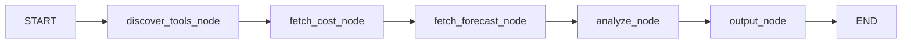

# AWS Cost Analysis + Remediation Agent

This project provides a Flask app backed by two LangGraph workflows:

- **Manager graph** (`graph/manager_graph.py`) for AWS cost analysis + forecast
- **Remediation graph** (`graph/remediation_graph.py`) for actionable cost optimization recommendations

It integrates with the AWS Billing & Cost Management MCP server and uses Groq for structured LLM outputs.

## What It Does

For a user query like _"What are my top 5 AWS services by spend and forecast for next month?"_ the app:

- Discovers available MCP tools
- Pulls monthly + MTD cost data from Cost Explorer
- Pulls next-month forecast
- Returns structured analysis (with UI-friendly formatted fields)
- Optionally derives remediation opportunities and fetches recommendation context from:
  - Cost Optimization Hub (`cost-optimization`, `rec-details`)
  - Compute Optimizer (`compute-optimizer`)

## Architecture

### 1) ManagerGraph (`graph/manager_graph.py`)



Key behavior:

- Discovers tools and checks AWS credential usability
- Computes:
  - previous full month
  - current MTD
  - same-period-last-month
- Queries Cost Explorer via MCP (`cost-explorer`)
- Produces top 5 services, totals, MTD deltas, and next full month forecast
- Runs `ManagerAgent` to produce summary output

Supported analysis scopes:

- `full_account` (default), `ec2`, `s3`, `rds`, `lambda`, `ebs`, `networking`

### 2) RemediationGraph (`graph/remediation_graph.py`)

```mermaid
flowchart LR
    START --> discover_tools_node
    discover_tools_node --> input_validation_node
    input_validation_node --> opportunity_detection_node
    opportunity_detection_node --> recommendation_fetch_node
    recommendation_fetch_node --> strategy_generator_node
    strategy_generator_node --> output_formatter_node
    output_formatter_node --> END
```



Key behavior:

- Validates remediation input items
- Detects opportunities from cost signals
- Fetches recommendation context via MCP tools
- Runs `RemediationAgent` to generate a structured remediation plan
- Normalizes output formatting for API/UI consumption

## API Endpoints

- `POST /api/analyze`
  - Body:
    - `query` (optional string)
    - `analysis_type` (optional; defaults to `full_account`)
  - Returns normalized analysis payload (`ok`, spend metrics, top services, forecast, summary, errors)

- `POST /api/recommend`
  - Body options:
    - `items` (optional explicit remediation input list), or
    - `query` + `analysis_type` (if `items` omitted, analysis is run first and top services are converted to remediation items)
  - Returns remediation plan JSON (`summary`, `remediations`)

There is also a form-based route:

- `POST /analyze` for the web UI (`templates/index.html`)

## Setup

### 1) Python + dependencies

- Requires **Python 3.11+**

Install with pip:

```bash
pip install -r requirements.txt
```

Or with `uv`:

```bash
uv sync
```

### 2) Environment variables

At minimum, configure:

- `GROQ_API_KEY`
- `GROQ_MODEL` (optional; defaults in `config.py`)
- `AWS_PROFILE`
- `AWS_REGION`

Note: `config.py` also defines `MCP_BILLING_ENDPOINT` and `MCP_PRICING_ENDPOINT` as required settings.

### 3) MCP server configuration

Review `server/aws_mcp.json`:

- MCP server command/args (currently uses `uvx`)
- AWS profile and region passed to the MCP child process

Ensure IAM permissions for Cost Explorer, forecasting, Cost Optimization Hub, and Compute Optimizer APIs as needed.

### 4) Run

Start Flask UI/API:

```bash
python app.py
```

For CLI/local sample run:

```bash
python main.py
```

## Key Files

- `app.py` - Flask routes, output normalization, and graph orchestration
- `graph/manager_graph.py` - cost/forecast analysis workflow
- `graph/remediation_graph.py` - remediation workflow
- `agents/manager_agent.py` - structured cost analysis generation
- `agents/remediation_agent.py` - structured remediation plan generation
- `utils/cost_processor.py` - Cost Explorer/forecast aggregation helpers
- `utils/opportunity_detector.py` - remediation opportunity detection
- `utils/recommendation_fetcher.py` - MCP recommendation context retrieval
- `server/client.py` - AWS Billing MCP client wrapper
- `models/schemas.py` - Pydantic state and response schemas


